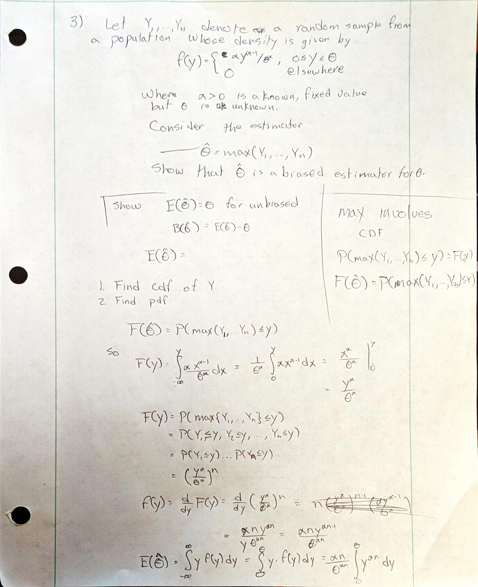
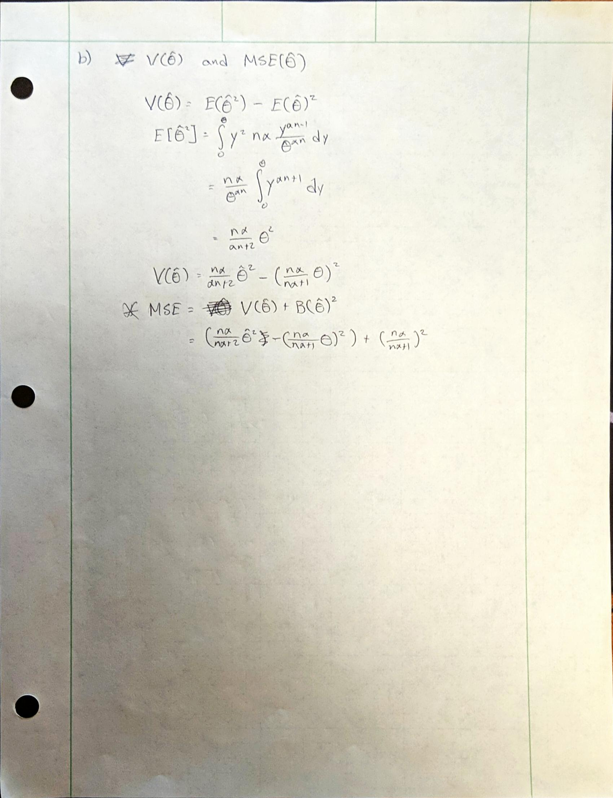

---
output:
  pdf_document: default
  html_document: default
  word_document: default
---

STAT430 Homework #4: Due Friday, March 1, 2019. 
========================================================

#### Name: 

*********************************************************************************
0. **Remember that there is no class or office hour on Monday, February 25.**
We start Chapter 8 in this homework, with some additional problems related to the end of Chapter 7.  Read **Sections 8.1-8.4** on estimation.   We have the first midterm February 22.  Be sure you are strong so far on distribution of maximum and minimum order statistic; expectation, variance and covariance calculations; normal probability computations; the "origin stories" of the $\chi^2$, $t$, and $F$ distributions; and the Central Limit Theorem and its applications and extensions (normal approximation for sample mean and sample total; normal approximation to the binomial; delta method; bias and mean squared error). This homework has some good review problems and is worth working on prior to the exam. 


1. Let $Y\sim$ Binomial$(n,p)$.  The "odds of success" are defined as 
\[
\frac{\mbox{probability of success}}{\mbox{probability of failure}}=\frac{p}{1-p}
\]
and the log-odds are
\[
\lambda=\ln\left(\frac{p}{1-p}\right).
\]
The standard, unbiased estimator of $p$ is $\hat p=Y/n$.  Plugging in this estimator, we have the estimated log-odds
\[
\hat\lambda = \ln\left(\frac{\hat p}{1-\hat p}\right).
\]
Use the delta method as described in class to determine the  approximate distribution of $\hat\lambda$ for large $n$.  For $p=0.3$ and $n=100$, verify that the variance of your approximate distribution is $1/21$.


*********************************************************************************

**Answer:**

$\bar Y = \frac{Y}{n} = \hat p$ Where, $Y_i \sim Bern(p)$

$\bar Y \sim N(E[y_i], \frac{Var[Y_i]}{n})$

$\hat p = \bar Y = Y/n = \sum Y_i/n$
$\sum Y_i \sim N(np, np(1-p))$

$ln(\frac{\hat p}{1-\hat p})$ estimates $ln(\frac{p}{1-p})$
$\hat\lambda = g(\hat p) \sim N(g(p),g^{`}(p)^2*\frac{p(1-p)}{n})$

So,

$\hat\lambda \sim N(ln(p/(1-p)), (\frac{1}{p} + \frac{1}{1-p})^{2}*\frac{p(1-p)}{n})$

$V(\hat\lambda) = (\frac{1}{p} + \frac{1}{1-p})^2 * \frac{p(1-p)}{n} = (\frac{1}{.3} + \frac{1}{.7})^2 * \frac{.3*.7}{100} = \frac{1}{21}$


*********************************************************************************

2. Suppose $Y_1,\ldots,Y_{40}$ denote a random sample  of measurements on the proportion of impurities in iron ore
samples. Let each $Y_i$ have probability density function given by
\[
f(y)=\begin{cases}
3y^2, & 0\le y \le 1,\cr
0, & \mbox{elsewhere}.
\end{cases}
\]
The ore is to be rejected by the potential buyers if $\bar Y$ exceeds $0.7$. Find the approximate probability that $P(\bar Y > 0.7)$ for the sample of size $n=40$.

*********************************************************************************

**Answer:**

$\bar Y = \frac{\sum Y_i}{n}$
$E(Y_i) = \int_0^1y*3y^2dy = \frac{3}{4}y^4|_0^1 = \frac{3}{4}$
$E(\bar Y) = E(\frac{\sum Y_i}{n}) = \frac{1}{n}E(\sum Y_i) = \frac{1}{n}\sum E(Y_i)$
$= \frac{1}{40}(40)(.75) = 0.75$

Since,

$Var(Y_i) = E(Y_i^2) - E(Y_i)^2 = \int_0^1y^23y^2dy - 0.75^2 = 0.0375$

$Var(\bar Y) = \sigma^2/n = 0.0375/40$

So,
$\bar Y \sim N(3/4, 3/3200)$

And we are looking for
$P(\bar Y > 0.7)$ After normalizing, $P(Z>-1.6329) = 0.9484$


*********************************************************************************


3. Let $Y_1,\ldots,Y_n$ denote a random sample from a population whose density is given by 
\[
f(y)=\begin{cases}
\alpha y^{\alpha-1}/\theta^\alpha, & 0\le y \le \theta,\cr
0, & \mbox{elsewhere},
\end{cases}
\]
where $\alpha>0$ is a known, fixed value, but $\theta$ is unknown.  Consider the estimator $\hat\theta=\max(Y_1,\ldots,Y_n)$.
(a). Show that $\hat\theta$ is a biased estimator for $\theta$.  

*********************************************************************************

**Answer:**
This would have taken me over an hour just to write up, so here is my handwritten work.
{ width=75% }\

{ width=75% }\

*********************************************************************************


(b).  Derive expressions for bias, variance and  MSE of $\hat\theta$ as functions of $n$, $\alpha$, and $\theta$.  (You do not need to simplify beyond evaluating the integrals.) Use `R` to evaluate your expressions numerically when $n=6$, $\alpha=2$, and $\theta=5$. 


*********************************************************************************

**Answer:**

{ width=75% }\


********************************************************************************

(c).  Use the following `R` code to simulate 10000 random samples of size $n=6$ from the original density with $\alpha=2$ and $\theta=5$ and compute $\hat\theta$ for each random sample. Then approximate the bias by `mean(theta_hat) - theta`, the variance by   `var(theta_hat)`, and the MSE by `mean((theta_hat - theta) ^ 2)`.  Compare to your theoretical values in (b).

```{r}
rsim <- function(n, alpha, theta){
  u <- runif(n)
  Y <- theta * u ^ (1 / alpha)
  return(Y)
}
nreps <- 10000
n <- 6
alpha <- 2
theta <- 5
set.seed(4302019)
Y <- rsim(n * nreps, alpha = 2, theta = 5) # simulate 10,000 random samples of size 6
YY <- matrix(Y, n, nreps)                  # arrange into matrix with random sample in each column
```

*********************************************************************************

**Answer:**

```{r}


```


*********************************************************************************


4. Complete **Exercise 8.2** of the text.

*********************************************************************************


**Answer:**


#### a)

Since $\hat\theta$ is unbiased, $B(\hat\theta) = E(\hat\theta) - \theta =0$

#### b)

If $B(\hat\theta) = 5$ then,

$5 = E(\hat\theta) - \theta$
$E(\hat\theta) = 5+\theta$

*********************************************************************************

5. Complete **Exercise 8.6** of the text.  If $\sigma_2^2$ is much larger than $\sigma_1^2$, does your answer make sense?  What if $\sigma_2^2$ is much smaller than $\sigma_1^2$?

*********************************************************************************

**Answer:**

#### a)

Show $B(\hat\theta_3) = 0$

$B(\hat\theta_3) = E(\hat\theta_3) - \theta$
$B(\hat\theta_3) = E(a\hat\theta_1 + (1-a)\hat\theta_2) - \theta$
Using properties of Expected Values,

$B(\hat\theta_3) = a\theta +(\theta - a\theta) - \theta = 0$

#### b)

$Var(\hat\theta_3) = Var(a\hat\theta_1 + (1-a)\hat\theta_2)$
$Var(\hat\theta_3) = a^2Var(\hat\theta_1) + (1-a)^2Var(\hat\theta_2)$
$Var(\hat\theta_3) = a^2\sigma_1^2 + (1-a^2)\sigma_2^2$

We would want a to be 0.5 to minimize the variance.


*********************************************************************************

6. Complete **Exercise 8.8** of the text, giving an explicit expression for the mean and variance of each estimator.  You can use the result of **Exercise 6.81**: if $Y_1,Y_2,\ldots,Y_n$ are iid exponential random variables with mean $\theta$, then $\min(Y_1,Y_2,\ldots,Y_n)$ has an exponential distribution with mean $\theta/n$. 

*********************************************************************************

**Answer:**

{ width=75% }\
{ width=75% }\

*********************************************************************************

7. Assess your results in problem 6 above via simulation, using $\theta=10$. Check your theoretical variance expressions against the empirical variances from simulation, and compare the estimators using side-by-side boxplots of their values. Use the following code to get started: 

```{r}
theta <- 10
set.seed(4302019)
Y <- rexp(3 * 10000, rate = 1 / theta)
YY <- matrix(Y, 3, 10000)
theta_hat1 <- YY[1, ]                  # Y_1 only
theta_hat2 <- (YY[1, ] + YY[2, ]) / 2  # (Y_1 + Y_2) / 2
var(theta_hat1)
var(theta_hat2)
# Side-by-side boxplots to compare estimators (you can add more estimators, separated by commas):
boxplot(theta_hat1, theta_hat2, col = "LightBlue", names = c(expression(hat(theta)[1]), expression(hat(theta)[2])))
abline(h = theta, lwd = 3, col = "red")
```

*********************************************************************************

**Answer:**
```{r}
theta <- 10
set.seed(4302019)
Y <- rexp(3 * 10000, rate = 1 / theta)
YY <- matrix(Y, 3, 10000)
theta_hat1 <- YY[1, ]                  # Y_1 only
theta_hat2 <- (YY[1, ] + YY[2, ]) / 2  # (Y_1 + Y_2) / 2
theta_hat3 <- (YY[1, ] + 2*YY[2, ]) / 3
theta_hat4 <- apply(YY, MARGIN = 2, FUN = min)
theta_hat5 <- apply(YY, MARGIN = 2, FUN = mean)
var(theta_hat1)
var(theta_hat2)
var(theta_hat3)
var(theta_hat4)
var(theta_hat5)
# Side-by-side boxplots to compare estimators (you can add more estimators, separated by commas):
boxplot(theta_hat1, theta_hat2, theta_hat3, theta_hat4, theta_hat5, col = "LightBlue", names = c(expression(hat(theta)[1]), expression(hat(theta)[2]), expression(hat(theta)[3]), expression(hat(theta)[4]), expression(hat(theta)[5])))
abline(h = theta, lwd = 3, col = "red")
```

*********************************************************************************


